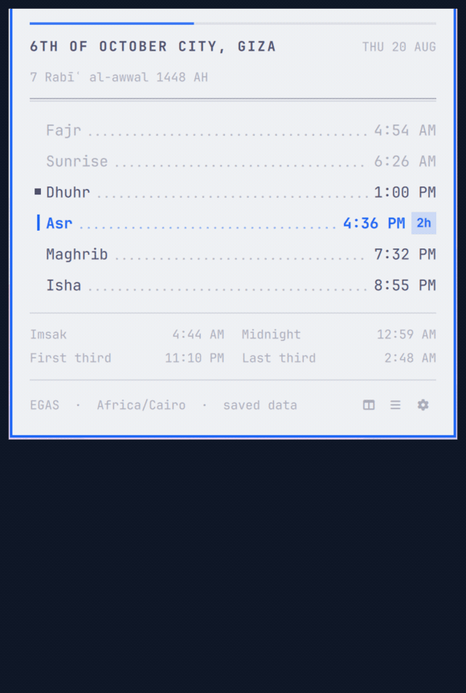
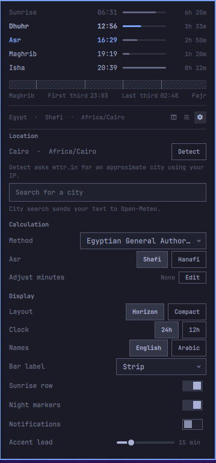
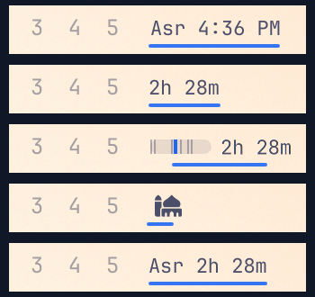

# OmaPrayers

Prayer times in the Omarchy bar: a to-scale day strip or a ruled timetable,
Arabic and English, an offline cache and optional notifications.

## Demo



`S` switches layouts, `A` switches to Arabic, and the gear opens a city
search that resolves a place to its coordinates *and* timezone.

## Screenshots




Five bar label forms, from name and countdown to a miniature day strip to a
single glyph:



## Highlights

- **Horizon** draws the day to scale, marks where you are, and compares the
  length of each prayer window. **Compact** is a ruled timetable with a
  night-marker grid.
- The bar chip pairs a miniature day strip with the next prayer countdown.
  Vertical bars use a rotated text label.
- English and Arabic names, dates and countdowns; Arabic uses a configurable
  Noto Naskh Arabic face.
- The current and next month are cached, so the schedule works offline.
- Optional prayer-time and advance notifications, deduplicated across
  monitors and shell reloads.
- Location and presentation are set from the panel. The city search lists
  same-named cities with their region and zone — `Springfield` spans two —
  and applies nothing until you pick one.

## Controls

- Left click toggles the panel; middle click cycles the bar label;
  right click (or `R`) refreshes online; `Esc` closes; `Tab` switches to
  the neighbouring panel.

| Key | Effect |
|---|---|
| `D` | Show or hide the settings section |
| `C` or `/` | Jump to the city search |
| `S` | Switch the panel layout |
| `B` | Cycle the bar label |
| `T` | Switch 24-hour and 12-hour |
| `A` | Switch English and Arabic |

`H`, `J`, `K`, `L` and `X` are reserved by Omarchy's panels.

## Requirements

- Omarchy 4 (Quattro)
- `curl` and `jq`
- `noto-fonts` for Arabic mode
- Network access to the [AlAdhan API](https://aladhan.com/prayer-times-api)
  for the first fetch; the cache covers later offline sessions

## Install

```bash
omarchy plugin add https://github.com/salemsayed/omaprayers.git --enable
```

The widget goes to the right section of the bar; move it with
`omarchy bar move io.github.salemsayed.omaprayers --section right --index 0`
if you prefer another spot.

## Configure

Layout, bar label, clock format, language, sunrise and night markers,
notifications and the accent lead time are on the panel's settings section.
Location, calculation method and tuning are configuration-only because they
invalidate the cache:

```bash
omarchy bar set io.github.salemsayed.omaprayers barDisplay "Icon only"
omarchy bar set io.github.salemsayed.omaprayers panelStyle "Compact"
omarchy bar set io.github.salemsayed.omaprayers timeFormat "12-hour"
omarchy bar set io.github.salemsayed.omaprayers notifications true --json
omarchy bar set io.github.salemsayed.omaprayers hanafi true --json
```

Change a location as a set — label, coordinates and timezone:

```bash
omarchy bar set io.github.salemsayed.omaprayers locationLabel "Alexandria"
omarchy bar set io.github.salemsayed.omaprayers latitude "31.2001"
omarchy bar set io.github.salemsayed.omaprayers longitude "29.9187"
omarchy bar set io.github.salemsayed.omaprayers timezone "Africa/Cairo"
```

Every option is in [Configuration](docs/CONFIGURATION.md).

## Remove

```bash
omarchy plugin disable io.github.salemsayed.omaprayers
omarchy plugin remove io.github.salemsayed.omaprayers
```

The cache is kept so a reinstall needs no fetch. To delete it too:

```bash
rm -r -- "$HOME/.local/state/omarchy/io.github.salemsayed.omaprayers"
```

## Data sources

Prayer calendars come from [AlAdhan](https://aladhan.com/prayer-times-api),
calculated for your explicit coordinates, timezone, method and adjustments.
The city search uses [Open-Meteo geocoding](https://open-meteo.com/en/docs/geocoding-api);
the optional *Detect* button reads the connection's apparent city from
[wttr.in](https://wttr.in) and only fills the search box. Nothing is applied
until you pick a result.

## Accuracy

- Explicit latitude, longitude and IANA timezone; the computer's timezone is
  never assumed to be the prayer location's.
- Absolute ISO-8601 instants from AlAdhan drive countdowns and notifications.
- Two months cached atomically, covering tomorrow's Fajr and year boundaries;
  a stale cache is shown as stale.
- Calculation method, Shafi/Hanafi Asr, high-latitude rule, midnight mode,
  Shafaq, Hijri adjustment, custom parameters and all nine tuning offsets.

Calculated times are not mosque iqama schedules. Choose the method used by
the nearest authority, compare with a trusted local calendar, and use the
tuning fields if needed. Defaults: Cairo, method 5 (Egyptian General
Authority of Survey), standard Asr, 24-hour, English, Horizon, notifications
off.

## License

[MIT](LICENSE) · [Third-party notices](THIRD_PARTY_NOTICES.md)
