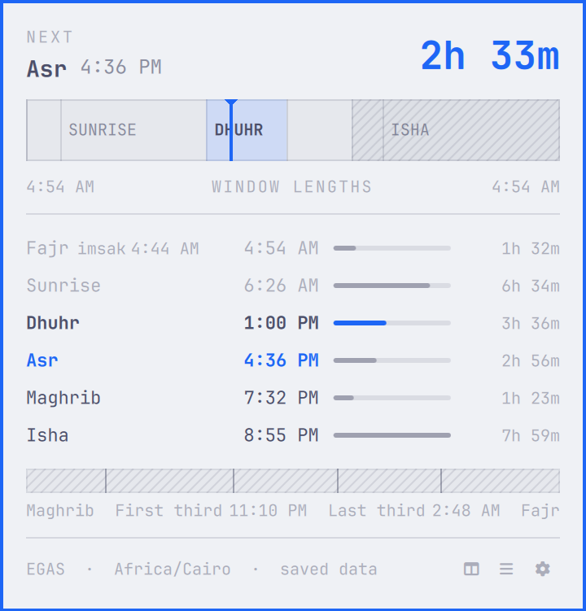
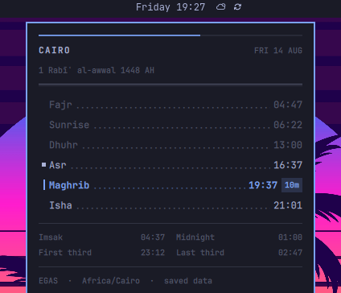
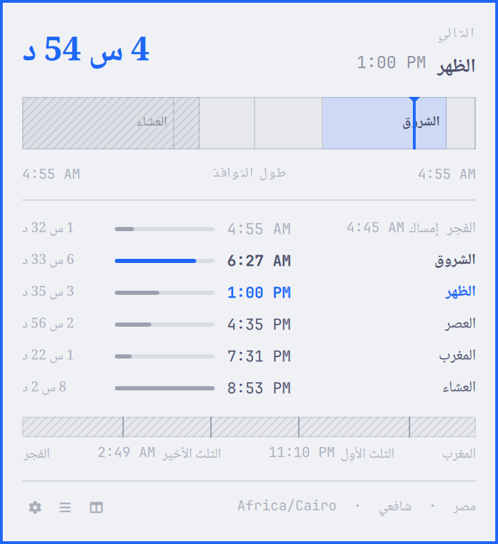

# OmaPrayers

Prayer times for the Omarchy bar, with two native panel layouts, Arabic and
English presentation, offline caching, and optional notifications.

## Screenshots







## What it does

- **Horizon** is the default panel layout. It draws the prayer day to scale,
  shows the current position, and compares the length of each prayer window.
- **Compact** is a ruled timetable card with dot leaders, current/next state,
  and a two-column night-marker grid.
- The default horizontal bar chip combines a miniature day strip with the next
  prayer countdown. Vertical bars use the same information as a rotated text
  label.
- Prayer names, dates, and countdowns support English and Arabic. Arabic text
  uses a separately configurable Noto Naskh Arabic face.
- The current and following month are cached locally, so a matching schedule
  remains available when the network is down.
- Optional prayer-time and advance notifications are deduplicated across
  monitors and shell reloads.

Controls:

- Left or middle click toggles the panel.
- Right-click the bar widget, or press `R` while the panel is open, to force an
  online refresh.
- `Esc` closes the panel.
- `Tab` / `Shift+Tab` switches between adjacent Omarchy panels.

## Requirements

- Omarchy Quattro with its Quickshell-based plugin system.
- `curl` and `jq`.
- The `noto-fonts` package for Arabic mode (`Noto Naskh Arabic`).
- Network access to the [AlAdhan API](https://aladhan.com/prayer-times-api) for
  the initial calendar fetch. A matching cache is used for later offline
  sessions.

Omarchy supplies the other runtime pieces used by the plugin: Bash, GNU
`date`, `flock`, coreutils, and `omarchy-notification-send` for optional
notifications. OmaPrayers bundles no framework, font, audio file, daemon, or
package installer.

## Install

Install the plugin, then place its widget on the bar:

```bash
omarchy plugin add https://github.com/salemsayed/omaprayers.git --enable
omarchy bar move io.github.salemsayed.omaprayers --section right --index 0
```

The manifest already declares `right` as the default section, so the explicit
move is optional.

To work from a local checkout instead:

```bash
omarchy plugin validate ~/Coding/omaprayers
omarchy plugin add file://$HOME/Coding/omaprayers --enable
```

`omarchy plugin add` clones the source, so a local path must be a Git
repository.

## Configure

Settings are stored inline on the bar entry, as required by Quattro. Examples:

```bash
omarchy bar set io.github.salemsayed.omaprayers barDisplay "Icon only"
omarchy bar set io.github.salemsayed.omaprayers panelStyle "Compact"
omarchy bar set io.github.salemsayed.omaprayers timeFormat "12-hour"
omarchy bar set io.github.salemsayed.omaprayers notifications true --json
omarchy bar set io.github.salemsayed.omaprayers notifyBeforeMinutes 15 --json
omarchy bar set io.github.salemsayed.omaprayers hanafi true --json
```

Changing location should update the label, coordinates, and timezone together:

```bash
omarchy bar set io.github.salemsayed.omaprayers locationLabel "Alexandria"
omarchy bar set io.github.salemsayed.omaprayers latitude "31.2001"
omarchy bar set io.github.salemsayed.omaprayers longitude "29.9187"
omarchy bar set io.github.salemsayed.omaprayers timezone "Africa/Cairo"
```

See [Configuration](docs/CONFIGURATION.md) for every option.

## Remove

Disable and remove the plugin:

```bash
omarchy plugin disable io.github.salemsayed.omaprayers
omarchy plugin remove io.github.salemsayed.omaprayers
```

The cache is deliberately retained so reinstalling does not require an
immediate network fetch. To remove it too, delete only the exact state
directory:

```bash
rm -r -- "$HOME/.local/state/omarchy/io.github.salemsayed.omaprayers"
```

When `XDG_STATE_HOME` is set, replace `$HOME/.local/state` with that value.

## Data source and credits

Prayer calendars come from the [AlAdhan API](https://aladhan.com/prayer-times-api).
OmaPrayers requests calculated times for the explicit latitude, longitude,
timezone, method, and adjustment settings supplied by the user; it does not
infer a location from an IP address or ambiguous city name.

The interface uses Omarchy's native Quickshell components and theme tokens.
See [Third-party notices](THIRD_PARTY_NOTICES.md) for the reference material
used during implementation.

## License

[MIT](LICENSE)

## Accuracy and qualification

### Accuracy and resilience

- Uses explicit latitude, longitude, and IANA timezone settings. It never
  assumes that the computer timezone is the prayer-location timezone.
- Requests ISO-8601 timestamps from AlAdhan and uses those absolute instants
  for countdowns and notifications.
- Fetches and atomically caches the current and following month, covering
  tomorrow's Fajr and month/year boundaries.
- Retains a matching cache when offline and clearly marks it stale.
- Serializes refreshes across multiple monitors and applies bounded network
  retries.
- Validates matching caches before use and rejects malformed, short, or
  incomplete provider responses rather than presenting partial schedules.
- Supports calculation method, Shafi/Hanafi Asr, high-latitude rule, midnight
  mode, Shafaq, Hijri adjustment, custom method parameters, and all nine
  AlAdhan tuning offsets.
- Notifications use Omarchy's native notification helper and are deduplicated
  across monitors and shell reloads. Transient delivery failures receive two
  bounded retries and surface a warning if all attempts fail.

Prayer calculations are not mosque iqama schedules. Choose the method used by
the closest relevant authority, compare the result with a trusted local
calendar, and use the tuning fields when needed.

### Defaults

The initial profile uses:

- Cairo (`30.0444`, `31.2357`) and `Africa/Cairo`;
- method 5, Egyptian General Authority of Survey;
- standard/Shafi Asr and angle-based high-latitude adjustment;
- 24-hour display and English labels;
- the Horizon panel and strip/countdown bar chip;
- notifications disabled.

### Theme compatibility

OmaPrayers consumes Omarchy's current `Color`, `Style`, spacing, typography,
and corner-radius tokens. Built-in, hand-authored, and
[Aether](https://github.com/bjarneo/aether)-generated Omarchy v4 themes work
through the same native boundary without an adapter or runtime dependency.
